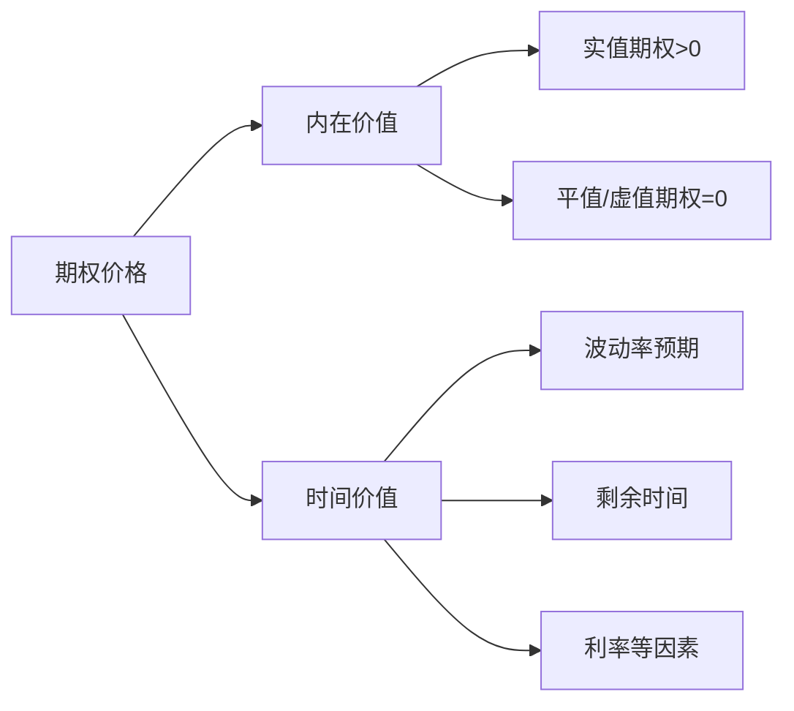

# 期权的价值是"空气"还是"真金白银"？拆解内在价值与时间价值的博弈法则

> ⚠️ **免责声明**：本文仅为知识分享，不构成任何投资建议！期权交易可能导致本金全部损失。市场有风险，决策需谨慎。

---

## 一、本质解析：期权价值的双引擎驱动

**权威定义**（摘自约翰·赫尔《期权、期货及其他衍生产品》第 9 章）：

> **期权价值 = 内在价值(Intrinsic Value) + 时间价值(Time Value)**
>
> - **内在价值**：立即行权可获得的收益（≥0）  
>   _认购期权 IV = max(标的价 - 行权价, 0)_  
>   _认沽期权 IV = max(行权价 - 标的价, 0)_
> - **时间价值**：期权价格超出内在价值的部分，反映未来获利可能性的溢价

**价值关系思维导图**：



---

## 二、案例实战：3 分钟掌握价值变化规律

### ▶ 案例 1：牛市中的认购期权价值分解（新手入门）

**初始设定**：

- 虚拟股票：XYZ 公司 现价=50 元
- 认购期权：行权价=55 元，权利金=3 元，到期=30 天

**价值拆解推演**：

```markdown
1. 内在价值计算 → max(50-55, 0) = 0 元（虚值期权）
2. 时间价值 = 权利金 - 内在价值 → 3 - 0 = 3 元
3. 情境变化推演：  
   → 第 15 天：XYZ 股价涨至 53 元 → IV=0 元，TV=2 元（时间衰减）  
   → 到期日：
   - 若 XYZ=58 元 → IV=3 元，TV=0 元（权利金=3 元）
   - 若 XYZ=52 元 → IV=0 元，TV=0 元（期权归零）
```

**损益表**：

| 到期股价 | 内在价值 | 时间价值 | 期权价格 | 买方盈亏 |
| -------- | -------- | -------- | -------- | -------- |
| 48 元    | 0        | 0        | 0        | -3 元    |
| 55 元    | 0        | 0        | 0        | -3 元    |
| 58 元    | 3        | 0        | 3        | 0 元     |
| 63 元    | 8        | 0        | 8        | +5 元    |

### ▶ 案例 2：波动率对时间价值的冲击（进阶实验）

**对比实验设定**：

- 平值认购期权（XYZ=50 元，行权价=50 元，到期=30 天）
- 波动率 20% vs 40%场景下的权利金变化

**关键发现**：

```markdown
→ 低波动(20%)：权利金=2.5 元 → IV=0 元，TV=2.5 元  
→ 高波动(40%)：权利金=5.0 元 → IV=0 元，TV=5.0 元  
→ 波动率翻倍 → 时间价值增长 100%（Black-Scholes 模型计算）
```

**多情景对比图**：

```
时间价值曲线
高波动率环境 → ██████ (5.0元)
低波动率环境 → ███ (2.5元)
到期日价值 → ▁ (归零)
```

---

## 三、核心要点总结

✅ **要点 1**：内在价值是"已兑现的收益"，时间价值是"未来的可能性溢价"  
✅ **要点 2**：时间价值随时间加速衰减（Theta 效应），波动率是其定价核心  
✅ **要点 3**：虚值期权纯由时间价值构成，到期归零风险极高

**价值组成速查表**：

| 期权状态 | 内在价值 | 时间价值 | 敏感指标   |
| -------- | -------- | -------- | ---------- |
| 深度实值 | 高       | 低       | Delta≈1    |
| 平值     | 0        | 最高     | Gamma 最大 |
| 深度虚值 | 0        | 低       | Vega 主导  |

---

## 四、高频疑问破解

**Q1：为什么深度虚值期权到期常归零？**  
❌ 误区："便宜期权翻倍概率高，值得赌"  
⚡️ 正解：深度虚值期权内在价值=0，纯靠时间价值支撑。随着到期临近，价格突破行权价概率急剧下降，时间价值归零不可逆。

**Q2：隐含波动率升高对买方利好还是利空？**  
❌ 误区："波动率涨期权必涨"  
⚡️ 正解：波动率升 → **时间价值增加 → 期权权利金上涨（利好买方）**。但需注意：波动率暴涨常伴随市场暴跌，认购期权可能因股价下跌抵消利好。

**Q3：为什么实值期权也有时间价值？**  
❌ 误区："实值期权只需看内在价值"  
⚡️ 正解：实值期权的时间价值来自"继续获利的机会"。例如行权价 50 元的认购期权，股价 55 元时内在价值 5 元。若权利金 5.5 元，则 0.5 元是市场对股价再涨的溢价。

**Q4：时间价值衰减最快在什么时候？**  
❌ 误区："离到期越远衰减越快"  
⚡️ 正解：衰减速度（Theta）在**到期前 30 天加速**，前 7 天呈指数级增长。平值期权到期前 1 天的时间价值可蒸发 50%。

**Q5：利率如何影响期权价值？**  
❌ 误区："利率变动与我无关"  
⚡️ 正解：**利率升 → 认购期权价值升，认沽期权价值降**（Black-Scholes 公式中的 r 参数）。因高利率环下，持有股票的机会成本增加，认购期权杠杆价值凸显。

---

## 五、延伸学习建议

- **深度阅读**：《期权、期货及其他衍生产品》第 9 章（约翰·赫尔）
- **关联知识**：希腊字母（Delta/Gamma/Theta/Vega）体系、波动率曲面
- **实战模拟**：在券商期权模拟盘观察价值组成实时变化

> 🔐 **风险再警示**：卖方（义务方）可能承担远超本金的损失！买方（权利方）最大损失为权利金，但归零风险极高。

---

**版权声明**：文中案例均为虚拟推演，不涉及真实标的推荐。数据计算基于 Black-Scholes 模型简化演示。
