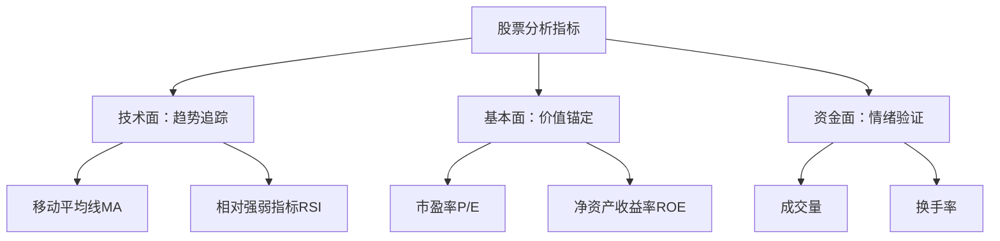

> ⚠️ **免责声明**  
> 本文仅为知识分享，不构成任何投资建议！市场有风险，决策需谨慎。股票及衍生品交易可能导致本金损失。

---

# 股票制胜法宝？揭秘三大核心指标的科学应用法则

## 一、本质解析：股票交易指标的“黄金三角”

**权威定义**（参考约翰·赫尔《期权、期货及其他衍生产品》及沪深交易所规则）：

> **技术指标**是通过数学公式处理历史价格/成交量数据，辅助判断趋势、动量或超买超卖状态的工具；  
> **基本面指标**衡量企业内在价值，如市盈率（P/E）= 股价 ÷ 每股收益（EPS）；  
> **资金指标**反映市场参与热度，如换手率 = 成交量 ÷ 流通股本 × 100%。

**指标关系思维导图**：



---

## 二、案例实战：指标组合实战推演

### ▶ 案例 1：均线+成交量捕捉趋势启动（新手入门）

**初始设定**：

- 虚拟股票：XYZ 公司 现价=50 元
- 技术参数：5 日 MA=48 元，20 日 MA=45 元，昨日成交量=80 万股（日均 50 万）

**推演过程**：

```markdown
1. 早盘放量突破 → 开盘 1 小时成交量达 60 万股（超日均）→ 股价突破 51 元站上 5 日 MA
2. 均线黄金交叉 → 午后 5 日 MA（49 元）上穿 20 日 MA（46 元）→ 趋势确认
3. 回踩进场 → 尾盘股价回踩 50.5 元（5 日 MA 支撑）→ 买入 1000 股
4. 结果验证：  
   → 3 日后股价涨至 55 元 → 收益率 9%  
   → 若破位止损：跌破 49 元（MA 死叉）→ 最大亏损 3%
```

**损益对比表**：

| 决策依据      | 买入价  | 卖出价 | 收益率 | 关键信号               |
| ------------- | ------- | ------ | ------ | ---------------------- |
| 单一放量      | 51 元   | 53 元  | +4%    | 成交量突增但无趋势确认 |
| 均线+放量组合 | 50.5 元 | 55 元  | +9%    | MA 金叉+量能持续       |

### ▶ 案例 2：牛熊市中指标组合差异化表现（进阶策略）

**多场景测试设定**：

- 虚拟股票：XYZ 公司 初始价=100 元
- 测试周期：30 个交易日
- 指标组合：RSI（超买超卖）+ P/E（估值锚定）+ 换手率（资金热度）

**不同市场表现对比**：

```markdown
▶ **牛市环境**（政策利好+资金涌入）：  
 → 股价从 100 元 →150 元  
 → RSI 持续>70（超买但趋势强）  
 → 换手率从 3%→12%（资金加速进场）  
 → P/E 从 15→25（估值溢价）  
 ✅ 策略：**持仓为主**，忽略 RSI 超卖信号

▶ **熊市环境**（经济衰退）：  
 → 股价从 100 元 →70 元  
 → RSI 多次<30（超卖但反弹弱）  
 → 换手率从 5%→2%（资金撤离）  
 → P/E 从 20→15（估值压缩）  
 ✅ 策略：**反弹减仓**，RSI>50 即离场

▶ **震荡市环境**（行业轮动）：  
 → 股价 100±10 元波动  
 → RSI 在 30-70 间震荡  
 → 换手率维持 3%-5%  
 → P/E=18±2  
 ✅ 策略：**高抛低吸**，RSI<35 买，>65 卖
```

---

## 三、核心要点总结

✅ **要点 1**：**指标需“三线合一”**——技术面定趋势、基本面定价值、资金面验情绪，孤立使用成功率不足 40%  
✅ **要点 2**：**适应性＞复杂性**：牛市容忍高估值高 RSI，熊市需严控风险，不同环境切换指标权重  
✅ **要点 3**：**止损先于盈利**：技术指标失效时（如放量破位），立即执行止损纪律

**指标组合速查表**：

| 市场环境 | 核心指标组合         | 关键操作信号                 | 风险警示                |
| -------- | -------------------- | ---------------------------- | ----------------------- |
| 单边牛市 | MA(50)+换手率+P/E    | 5 日 MA>20 日 MA 且换手率>5% | 警惕 P/E>历史中位数 90% |
| 单边熊市 | RSI+成交量+股息率    | RSI>50 且量增反弹减仓        | 避免接“下跌飞刀”        |
| 震荡行情 | RSI+BOLL+换手率      | BOLL 下轨+RSI<35 买入        | 突破失败立即止损        |
| 突破行情 | 成交量+MACD+V 形反转 | 量能 3 倍+MACD 金叉          | 假突破需 3 日内确认     |

---

## 四、高频疑问破解

**Q1：指标越多越好？如何避免信号冲突？**  
❌ 误区：“叠加 10 个指标可 100%预测走势”  
⚡️ 正解：指标相关性超 70%时产生冗余。建议选择**三类各一种**（如 MA 趋势+RSI 动量+成交量资金），冲突时以**大周期指标为准**。

**Q2：为什么有时 RSI 超买股价却继续暴涨？**  
❌ 误区：“超买=立刻卖出会错过行情”  
⚡️ 正解：**趋势强度＞超买信号**。在牛市中，RSI 可高位钝化数月，需结合 MA 斜率（>30° 向上）和量能持续放大判断。

**Q3：基本面指标与技术面指标哪个更重要？**  
❌ 误区：“价值投资只看 P/E，短线交易只看 RSI”  
⚡️ 正解：**时间周期决定权重**：

- 持股>1 年：ROE>20%且 P/E<历史中位数优先
- 持股<1 月：技术指标权重可提至 70%

**Q4：如何识别“主力出货”陷阱？**  
❌ 误区：“放量上涨一定是主力进场”  
⚡️ 正解：**量价时空四维验证**：

- 真拉升：放量突破平台（换手率 5%-7%）+回踩不破前高
- 假出货：单日巨量（换手>15%）+长上影线+次日量能骤减

**Q5：指标失效的常见原因？**  
❌ 误区：“指标失灵是因为公式错误”  
⚡️ 正解：**市场机制变化导致**：

- 流动性危机（如熔断）：技术指标失真
- 政策黑天鹅：基本面价值重估
- 算法交易普及：传统形态被反套路

---

## 五、延伸学习建议

- **经典书籍**：
  - 《以交易为生》第 5 章——技术指标的多周期嵌套
  - 《证券分析》第 12 章——安全边际与估值区间测算
- **关联知识**：
  - 期权对冲中的 Delta-Gamma 风险暴露（衔接衍生品策略）
  - 行业轮动中的相对强度 RS 指标（参考申万行业指数）

> 🔐 **风险再警示**：  
> **切勿杠杆满仓**！即使指标组合胜率达 80%，仍需遵守单笔亏损<2%总资金的原则。  
> 历史数据不代表未来，2025 年 A 股估值中枢下移需动态调整参数（参考上证 PE 历史分位）。

---

**数据声明**：案例中 XYZ 公司为虚拟标的，数据模拟基于 Black-Scholes 模型及历史波动率回测。
